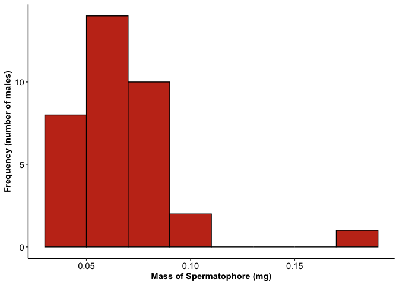
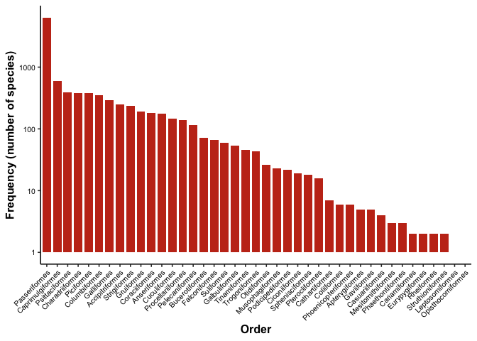

Lab 3 Report
================
brittneynelsen
2021-02-02

## Instructions

In each section below, create the appropriate graph and answer the
questions. Replace any triple underscores \_\_\_ with your own text.

Replace the \_\_\_’s in your README.

Knit your README and this Lab Report.

## Fireflies

Male fireflies of the species *Photinus ignitus* attract females with
pulses of light. Flashes of longer duration seem to attract the most
females. During mating, the male transfers a spermatophore to the
female. Besides containing sperm, the spermatophore is rich in protein
that is distributed by the female to her fertilized eggs. The data below
are measurements of spermatophore mass (in mg) of 35 males (Cratsley and
Lewis 2003). This question comes from your textbook.

The path to the data is
“<https://whitlockschluter.zoology.ubc.ca/wp-content/data/chapter02/chap02q19FireflySpermatophoreMass.csv>”

> A. Insert an R code chunk and create a graph depicting the frequency
> distribution of the 35 mass measurements. It should have legible text
> and appropriate axis labels.

``` r
# Firefly Data -----------------------------------------------------------

library(tidyverse)
```

    ## ── Attaching packages ─────────────────────────────────────── tidyverse 1.3.0 ──

    ## ✓ ggplot2 3.3.2     ✓ purrr   0.3.4
    ## ✓ tibble  3.0.4     ✓ dplyr   1.0.2
    ## ✓ tidyr   1.1.2     ✓ stringr 1.4.0
    ## ✓ readr   1.4.0     ✓ forcats 0.5.0

    ## ── Conflicts ────────────────────────────────────────── tidyverse_conflicts() ──
    ## x dplyr::filter() masks stats::filter()
    ## x dplyr::lag()    masks stats::lag()

``` r
# Read Data -----------------------------------------------------------------

firefly_data <- read_csv("https://whitlockschluter.zoology.ubc.ca/wp-content/data/chapter02/chap02q19FireflySpermatophoreMass.csv")
```

    ## 
    ## ── Column specification ────────────────────────────────────────────────────────
    ## cols(
    ##   spermatophoreMass = col_double()
    ## )

``` r
firefly_data # Confirming data was correct
```

    ## # A tibble: 35 x 1
    ##    spermatophoreMass
    ##                <dbl>
    ##  1             0.047
    ##  2             0.037
    ##  3             0.041
    ##  4             0.045
    ##  5             0.039
    ##  6             0.064
    ##  7             0.064
    ##  8             0.065
    ##  9             0.079
    ## 10             0.07 
    ## # … with 25 more rows

``` r
# Graph -------------------------------------------------------------------
ggplot(data = firefly_data) +
  geom_histogram(mapping = aes(x = spermatophoreMass), binwidth = 0.02,
                 fill = "#C5351B", color = "black") +
  labs(x = "Mass of Spermatophore (mg)", y = "Frequency (number of males)") +
  theme_classic() +
  theme(
    axis.title = element_text(face = "bold"),
    axis.text = element_text(color = "black", size = rel(1))
  )
```

<!-- -->

> B. What type of graph did you choose in part (A)? Why?

I chose a histogram because it shows the distribution of one numerical
variable,fireflies. They are better at showing frequency distribution.

> C. Describe the shape of the frequency distribution. What are its main
> features?

The shape of the frequency of the graph is right skewed. There was an
outlier sitting at the points, 0.17mg through 0.18mg. There was also a
bell-shaped curve between the points 0.03 mg and 0.10 mg.

> D. What term would be used to describe the largest measurement in the
> frequency distribution? You can refer to the lecture slides, your
> notes, or the textbook.

Mode.

## Bird orders

The ebird\_taxonomy dataset in the auk package is a simplified version
of the taxonomy used by eBird. This taxonomy is based on the Clements
Checklist. The dataset contains all known species of birds and their
taxonomic order and family. The code below creates a new dataset named
birds which consists of

``` r
library(auk)                          # load the auk package
```

    ## auk 0.4.2 is designed for EBD files downloaded after 2019-08-15. 
    ## No EBD data directory set, see ?auk_set_ebd_path to set EBD_PATH 
    ## eBird taxonomy version:  2019

``` r
birds <- ebird_taxonomy %>%           # start with the ebird_taxonomy data
  as_tibble() %>%                     # tibbles print better in the console
  filter(category == "species")       # remove non-species taxa
```

> E. How many bird species are in the new birds dataset? How did you
> find out?

There are 10,721 bird species. I created a table showing scientific
names, from this point I was able to determine that there were 10,721
rows representing the species.

> H. How many orders are there? You can get this right by counting on
> the graph, but you will only get full points if you use some code to
> figure it out.

There are 41 orders. I made a contigency table consisting of the orders
and frequency. The 41 rows allow me to see that there are 41 orders.

> F. Insert an R code chunk and create a graph depicting the
> distribution of orders in the birds dataset. Sort the orders with the
> most frequent on the left. It should have legible text and appropriate
> axis labels.

``` r
ggplot(data = birds) +
  geom_bar(mapping = aes(x = fct_infreq(order)), fill = "#C5351B", 
           width = .8) +
  labs(x = "Order", y = "Frequency (number of species)") +
  scale_y_log10() +
  theme_classic(base_size = 12) +
  theme(
    axis.title = element_text(face = "bold"),
    axis.text = element_text(color = "black", size = rel(0.65)),
    axis.text.x = element_text(angle = 45, hjust = 1)
  )  
```

<!-- -->

> G. What kind of graph did you create? Why?

I created a bar graph because the bar graph represents the number of
birds in that species that were identified. There were many different
categorical values. You couldn’t use a Histogram because that is for one
specific numerical value.

## Links to peer review

I reviewed Ethans’s lab report at this URL:
<https://github.com/BIOL275-MSUM/lab-3-intro-to-ggplot-Ethan-Dotzler>

Ethan reviewed my lab report at this URL:
<https://github.com/BIOL275-MSUM/lab-3-intro-to-ggplot-brittneynelsen>

## Session Info

Here is my session information:

``` r
sessioninfo::session_info()
```

    ## ─ Session info ───────────────────────────────────────────────────────────────
    ##  setting  value                       
    ##  version  R version 4.0.3 (2020-10-10)
    ##  os       macOS Big Sur 10.16         
    ##  system   x86_64, darwin17.0          
    ##  ui       X11                         
    ##  language (EN)                        
    ##  collate  en_US.UTF-8                 
    ##  ctype    en_US.UTF-8                 
    ##  tz       America/Chicago             
    ##  date     2021-02-02                  
    ## 
    ## ─ Packages ───────────────────────────────────────────────────────────────────
    ##  package     * version date       lib source        
    ##  assertthat    0.2.1   2019-03-21 [1] CRAN (R 4.0.2)
    ##  auk         * 0.4.3   2020-11-23 [1] CRAN (R 4.0.2)
    ##  backports     1.2.0   2020-11-02 [1] CRAN (R 4.0.2)
    ##  broom         0.7.2   2020-10-20 [1] CRAN (R 4.0.2)
    ##  cellranger    1.1.0   2016-07-27 [1] CRAN (R 4.0.2)
    ##  cli           2.1.0   2020-10-12 [1] CRAN (R 4.0.2)
    ##  colorspace    1.4-1   2019-03-18 [1] CRAN (R 4.0.2)
    ##  crayon        1.3.4   2017-09-16 [1] CRAN (R 4.0.2)
    ##  curl          4.3     2019-12-02 [1] CRAN (R 4.0.1)
    ##  DBI           1.1.0   2019-12-15 [1] CRAN (R 4.0.2)
    ##  dbplyr        2.0.0   2020-11-03 [1] CRAN (R 4.0.2)
    ##  digest        0.6.27  2020-10-24 [1] CRAN (R 4.0.2)
    ##  dplyr       * 1.0.2   2020-08-18 [1] CRAN (R 4.0.2)
    ##  ellipsis      0.3.1   2020-05-15 [1] CRAN (R 4.0.2)
    ##  evaluate      0.14    2019-05-28 [1] CRAN (R 4.0.1)
    ##  fansi         0.4.1   2020-01-08 [1] CRAN (R 4.0.2)
    ##  farver        2.0.3   2020-01-16 [1] CRAN (R 4.0.2)
    ##  forcats     * 0.5.0   2020-03-01 [1] CRAN (R 4.0.2)
    ##  fs            1.5.0   2020-07-31 [1] CRAN (R 4.0.2)
    ##  generics      0.1.0   2020-10-31 [1] CRAN (R 4.0.2)
    ##  ggplot2     * 3.3.2   2020-06-19 [1] CRAN (R 4.0.2)
    ##  glue          1.4.2   2020-08-27 [1] CRAN (R 4.0.2)
    ##  gtable        0.3.0   2019-03-25 [1] CRAN (R 4.0.2)
    ##  haven         2.3.1   2020-06-01 [1] CRAN (R 4.0.2)
    ##  hms           0.5.3   2020-01-08 [1] CRAN (R 4.0.2)
    ##  htmltools     0.5.0   2020-06-16 [1] CRAN (R 4.0.2)
    ##  httr          1.4.2   2020-07-20 [1] CRAN (R 4.0.2)
    ##  jsonlite      1.7.1   2020-09-07 [1] CRAN (R 4.0.2)
    ##  knitr         1.30    2020-09-22 [1] CRAN (R 4.0.2)
    ##  labeling      0.4.2   2020-10-20 [1] CRAN (R 4.0.2)
    ##  lifecycle     0.2.0   2020-03-06 [1] CRAN (R 4.0.2)
    ##  lubridate     1.7.9   2020-06-08 [1] CRAN (R 4.0.2)
    ##  magrittr      1.5     2014-11-22 [1] CRAN (R 4.0.2)
    ##  modelr        0.1.8   2020-05-19 [1] CRAN (R 4.0.2)
    ##  munsell       0.5.0   2018-06-12 [1] CRAN (R 4.0.2)
    ##  pillar        1.4.6   2020-07-10 [1] CRAN (R 4.0.2)
    ##  pkgconfig     2.0.3   2019-09-22 [1] CRAN (R 4.0.2)
    ##  purrr       * 0.3.4   2020-04-17 [1] CRAN (R 4.0.2)
    ##  R6            2.5.0   2020-10-28 [1] CRAN (R 4.0.2)
    ##  Rcpp          1.0.5   2020-07-06 [1] CRAN (R 4.0.2)
    ##  readr       * 1.4.0   2020-10-05 [1] CRAN (R 4.0.2)
    ##  readxl        1.3.1   2019-03-13 [1] CRAN (R 4.0.2)
    ##  reprex        0.3.0   2019-05-16 [1] CRAN (R 4.0.2)
    ##  rlang         0.4.8   2020-10-08 [1] CRAN (R 4.0.2)
    ##  rmarkdown     2.5     2020-10-21 [1] CRAN (R 4.0.3)
    ##  rstudioapi    0.11    2020-02-07 [1] CRAN (R 4.0.2)
    ##  rvest         0.3.6   2020-07-25 [1] CRAN (R 4.0.2)
    ##  scales        1.1.1   2020-05-11 [1] CRAN (R 4.0.2)
    ##  sessioninfo   1.1.1   2018-11-05 [1] CRAN (R 4.0.2)
    ##  stringi       1.5.3   2020-09-09 [1] CRAN (R 4.0.2)
    ##  stringr     * 1.4.0   2019-02-10 [1] CRAN (R 4.0.2)
    ##  tibble      * 3.0.4   2020-10-12 [1] CRAN (R 4.0.2)
    ##  tidyr       * 1.1.2   2020-08-27 [1] CRAN (R 4.0.2)
    ##  tidyselect    1.1.0   2020-05-11 [1] CRAN (R 4.0.2)
    ##  tidyverse   * 1.3.0   2019-11-21 [1] CRAN (R 4.0.2)
    ##  utf8          1.1.4   2018-05-24 [1] CRAN (R 4.0.2)
    ##  vctrs         0.3.4   2020-08-29 [1] CRAN (R 4.0.2)
    ##  withr         2.3.0   2020-09-22 [1] CRAN (R 4.0.2)
    ##  xfun          0.19    2020-10-30 [1] CRAN (R 4.0.2)
    ##  xml2          1.3.2   2020-04-23 [1] CRAN (R 4.0.2)
    ##  yaml          2.2.1   2020-02-01 [1] CRAN (R 4.0.2)
    ## 
    ## [1] /Library/Frameworks/R.framework/Versions/4.0/Resources/library
